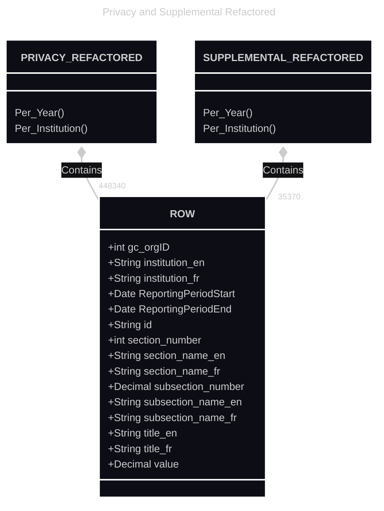

```mermaid
graphflowchart LR
 subgraph B1["Refactor Open Datasets"]
    direction RL
        f1["Parse_ATI_Stats_Forms.ipynb"]
        i1["Parse_Supplemental_Stats_Forms.ipynb"]
  end
 subgraph B2["Gen Stats Report HTML from Open Data"]
    direction BT
        f2["f2"]
        i2["i2"]
  end
 subgraph B3["PrePub Checks"]
    direction BT
        f3["GH Action 
        Tests"]
        i3["Test Artifacts"]
        i4["TBS ATI Pol. Tm"]
  end
 subgraph ATI-REPORT-REPORTER["ATI-REPORT-REPORTER"]
    direction TB
        B1
        B2
        B3
  end
    i1 --> f1
    i2 --> f2
    A["A"] --> ATI-REPORT-REPORTER
    ATI-REPORT-REPORTER --> B["B"]
    B1 --> B2
    n1[" "] --> B3
    f3 <--> i4
    i3 <--> i4
    n2[" "]
    n3["This is sample label"]
    n4[" "]

    n1@{ icon: "fa:file-excel", pos: "b"}
    n2@{ icon: "mc:default", pos: "b"}
    n3@{ img: "https://static.mermaidchart.dev/whiteboard/default-image-shape.svg", h: 200, w: 200, pos: "b"}
    n4@{ icon: "fa:file-code", pos: "b"}

```


